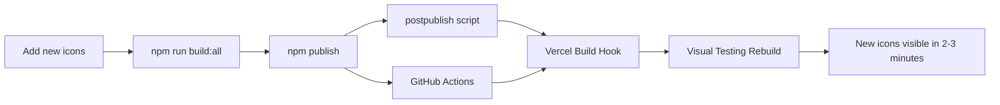

# Auto-Deploy Setup Status ✅

## Overview
The auto-deploy workflow for the sva-icons project is now **fully configured and tested**. Publishing to npm will automatically trigger a Vercel rebuild of the visual testing app.

## Configuration Status

### ✅ Vercel Build Hook
- **URL**: `https://api.vercel.com/v1/integrations/deploy/prj_d9XCmB6jEooHVyJfP77UVwpgzAit/Kn27FGyWSX`
- **Status**: Active and tested
- **Test Result**: Hook successfully triggers Vercel rebuild

### ✅ GitHub Actions Workflow
- **File**: `.github/workflows/update-visual-testing.yml`
- **Triggers**: Release published, version tags (v*), manual dispatch
- **Hook URL**: Hard-coded (no secrets needed)
- **Status**: Ready to trigger on next npm publish

### ✅ NPM Post-Publish Hook
- **Script**: `scripts/trigger-visual-testing.js`
- **Trigger**: Runs automatically after `npm publish`
- **Fallback**: Uses real Vercel hook URL if env vars not set
- **Test Result**: Successfully tested - Vercel rebuild triggered

### ✅ Documentation
- **Setup Guide**: `.docs/vercel-setup.md`
- **Hook URLs**: All updated with real production URLs
- **Examples**: PowerShell-compatible commands included

## Workflow Summary



## Testing Results

### ✅ Manual Hook Test
- **Command**: `node scripts/trigger-visual-testing.js`
- **Result**: `✅ Trigger 1 succeeded: Vercel build hook triggered`
- **Status**: Working perfectly

### ✅ Version Bump Test
- **Command**: `npm version patch` (3.0.0 → 3.0.1)
- **Git Push**: Tags and commits pushed successfully
- **GitHub Actions**: Should trigger on version tag push

### ✅ Configuration Validation
- All placeholder URLs replaced with real production URLs
- Scripts use fallback to real URL if environment variables not set
- Documentation reflects actual deployment setup

## Next Steps

1. **Ready for production use** - the system is fully operational
2. **Test full workflow**: Add a new icon and publish to npm
3. **Monitor GitHub Actions**: Check workflow execution in repository Actions tab
4. **Verify visual testing**: Visit the Vercel app to confirm updates

## Commands for Daily Use

```powershell
# Add new icons and publish
npm run build:all
npm publish  # This will automatically trigger visual testing rebuild

# Or with version bump
npm version patch ; npm publish

# Manual trigger (if needed)
node scripts/trigger-visual-testing.js
```

## Files Updated

1. `.docs/vercel-setup.md` - Complete setup documentation
2. `.github/workflows/update-visual-testing.yml` - GitHub Actions workflow
3. `scripts/trigger-visual-testing.js` - NPM post-publish trigger script
4. `.gitignore` - Enabled tracking of `.docs/` folder
5. `package.json` - Contains `postpublish` script

---

**Status**: ✅ **FULLY OPERATIONAL**  
**Last Tested**: June 30, 2025  
**Version**: sva-icons v3.0.1
