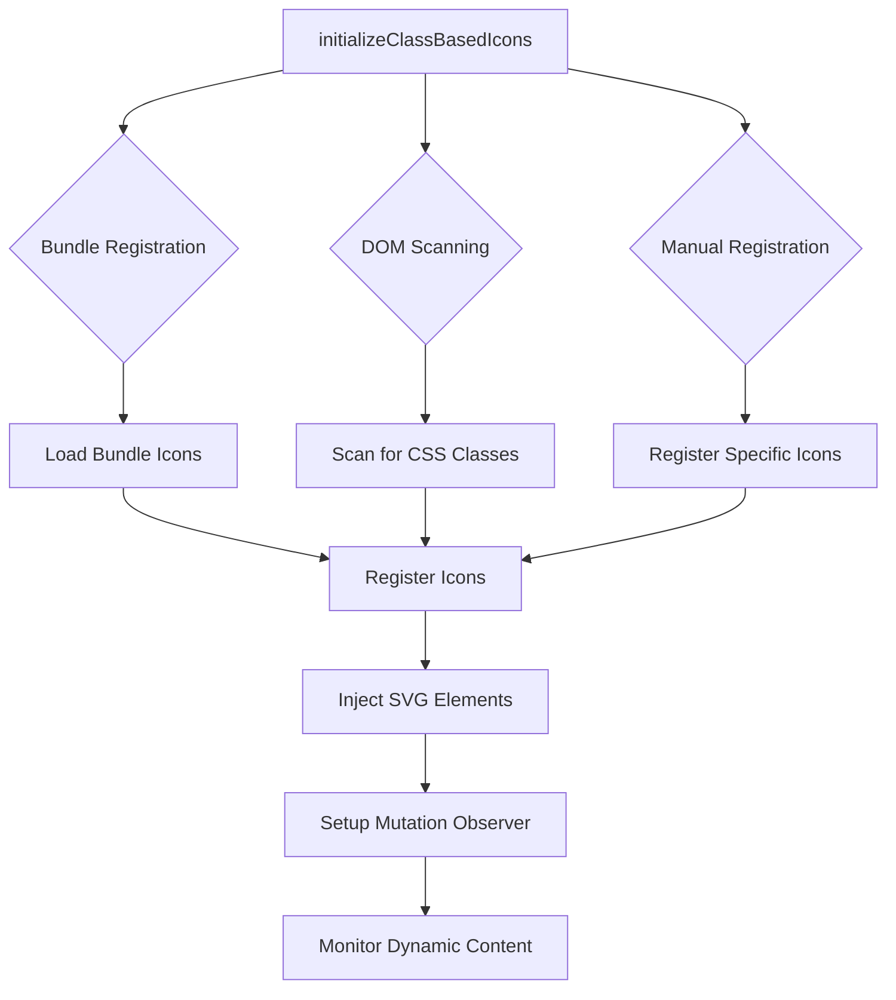

# SVA Icons v3.1.0 - Technical Implementation Details

## 🔧 System Architecture

### **Auto-Registration Flow**



### **Module Structure**

```
sva-icons/dist/class-based/esm/
├── auto-register.js          # Main auto-registration API
├── scanner.js               # DOM scanning utilities  
├── resolver.js              # Icon resolution and registration
├── injector.js              # SVG injection engine
├── observer.js              # Mutation observer for dynamic content
└── index.js                 # Legacy class-based API
```

---

## 🎯 Core APIs

### **initializeClassBasedIcons(options)**

Main entry point for the auto-registration system.

```typescript
interface AutoRegisterOptions {
  // Icon Sources
  autoRegister?: string | string[];     // Manual icon list
  registerBundles?: string[];           // Bundle names to register
  scanDOM?: boolean;                    // Scan DOM for classes (default: true)
  
  // Behavior  
  prefix?: string;                      // CSS class prefix (default: 'sva-icon-')
  scope?: Element;                      // Root element (default: document)
  enableObserver?: boolean;             // Dynamic monitoring (default: true)
}

interface AutoRegisterResult {
  success: boolean;                     // Overall success status
  registered: string[];                // Successfully registered icon names
  scanned: string[];                   // Icons found during DOM scan
  errors: string[];                    // Error messages
  stats: {
    totalRegistered: number;
    fromAutoRegister: number;
    fromBundles: number;
    fromDOMScan: number;
    injected?: number;
  };
}
```

### **Bundle System**

Pre-configured icon collections for common use cases:

```javascript
const BUNDLE_MAPPINGS = {
  'ui-essentials': ['plus', 'minus', 'settings', 'cross', 'tick', 'search', 'filter', 'edit'],
  'automotive-core': ['car', 'battery', 'charging', 'alert', 'speed', 'fuel-type', 'engine-power'],
  'navigation': ['arrow-up', 'arrow-down', 'arrow-left', 'arrow-right', 'directions', 'map-view'],
  'communication': ['phone', 'email', 'chat', 'message', 'contact-phone', 'contact-email'],
  'media': ['play', 'pause', 'volume', 'camera', 'video', 'gallery'],
  'commerce': ['price', 'payment', 'calculator-1', 'offers', 'trade-in']
};
```

---

## ⚙️ Internal Implementation

### **DOM Scanning Process**

```javascript
// Simplified scanner implementation
export async function autoRegisterFromDOM(options = {}) {
  const { prefix = 'sva-icon-', scope = document } = options;
  
  // 1. Find all elements with icon classes
  const iconElements = scope.querySelectorAll(`[class*="${prefix}"]`);
  const iconNames = new Set();
  
  // 2. Extract icon names from CSS classes
  iconElements.forEach(element => {
    const classes = Array.from(element.classList);
    classes.forEach(className => {
      if (className.startsWith(prefix)) {
        const iconName = className.replace(prefix, '');
        if (iconName) iconNames.add(iconName);
      }
    });
  });
  
  // 3. Register discovered icons
  const uniqueIconNames = Array.from(iconNames);
  await registerIconsFromList(uniqueIconNames);
  
  return uniqueIconNames;
}
```

### **Dynamic Icon Loading**

```javascript
// Simplified registration implementation
async function registerIconsFromList(iconNames) {
  const iconsToRegister = {};
  
  for (const iconName of iconNames) {
    try {
      // Dynamic import of icon function
      const iconModule = await import(`../../icons/esm/${iconName}.js`);
      const iconFunction = iconModule.default || iconModule[iconName];
      
      if (iconFunction) {
        iconsToRegister[iconName] = iconFunction;
      }
    } catch (error) {
      console.warn(`Failed to load icon "${iconName}":`, error.message);
    }
  }
  
  // Register with resolver
  registerIcons(iconsToRegister);
}
```

### **SVG Injection Engine**

```javascript
// Simplified injector implementation
class SVGInjector {
  inject(element, iconName, modifierClasses = []) {
    try {
      // 1. Resolve icon function
      const iconFunction = resolveIcon(iconName);
      if (!iconFunction) {
        return { success: false, error: 'Icon not found' };
      }
      
      // 2. Extract configuration from classes
      const config = this.parseModifierClasses(modifierClasses);
      
      // 3. Generate SVG
      const svgHtml = iconFunction(config);
      
      // 4. Inject into element
      element.innerHTML = svgHtml;
      element.setAttribute('data-sva-processed', 'true');
      
      return { success: true };
    } catch (error) {
      return { success: false, error: error.message };
    }
  }
  
  parseModifierClasses(classes) {
    const config = {};
    
    classes.forEach(cls => {
      // Parse size classes (sva-size-m, sva-size-l, etc.)
      if (cls.startsWith('sva-size-')) {
        config.size = this.sizes[cls.replace('sva-size-', '')];
      }
      
      // Parse color classes
      if (cls.startsWith('sva-color-')) {
        config.color = `var(--sva-icon-color-${cls.replace('sva-color-', '')})`;
      }
    });
    
    return config;
  }
}
```

### **Mutation Observer**

```javascript
// Simplified observer implementation
export function initializeObserver(options = {}) {
  const { prefix = 'sva-icon-', onIconsFound } = options;
  
  const observer = new MutationObserver(debounce(async (mutations) => {
    const addedNodes = [];
    
    mutations.forEach(mutation => {
      mutation.addedNodes.forEach(node => {
        if (node.nodeType === Node.ELEMENT_NODE) {
          addedNodes.push(node);
        }
      });
    });
    
    if (addedNodes.length > 0) {
      // Scan new nodes for icon classes
      const iconNames = await scanNodesForIcons(addedNodes, prefix);
      
      if (iconNames.length > 0 && onIconsFound) {
        onIconsFound(iconNames);
      }
    }
  }, 50));
  
  observer.observe(document.body, {
    childList: true,
    subtree: true
  });
  
  return observer;
}
```

---

## 🔍 Performance Optimizations

### **Batch Processing**

Icons are processed in batches to prevent blocking the main thread:

```javascript
async function processIcons(iconElements, batchSize = 100) {
  let injected = 0;
  
  for (let i = 0; i < iconElements.length; i += batchSize) {
    const batch = iconElements.slice(i, i + batchSize);
    
    for (const iconElement of batch) {
      const result = injector.inject(
        iconElement.element,
        iconElement.iconName,
        iconElement.modifierClasses
      );
      
      if (result.success) injected++;
    }
    
    // Yield to browser between batches
    if (i + batchSize < iconElements.length) {
      await new Promise(resolve => setTimeout(resolve, 0));
    }
  }
  
  return injected;
}
```

### **Debounced Mutation Observation**

```javascript
function debounce(func, delay) {
  let timeoutId;
  return function (...args) {
    clearTimeout(timeoutId);
    timeoutId = setTimeout(() => func.apply(this, args), delay);
  };
}
```

### **Duplicate Prevention**

```javascript
// Skip already processed elements
if (element.querySelector('svg') || element.hasAttribute('data-sva-processed')) {
  continue;
}
```

---

## 🧪 Testing Considerations

### **Unit Testing**

```javascript
// Test auto-registration
describe('Auto Registration', () => {
  test('should register icons from bundles', async () => {
    const result = await initializeClassBasedIcons({
      registerBundles: ['ui-essentials']
    });
    
    expect(result.success).toBe(true);
    expect(result.stats.fromBundles).toBeGreaterThan(0);
  });
  
  test('should scan DOM for icon classes', async () => {
    document.body.innerHTML = '<div class="sva-icon-plus"></div>';
    
    const result = await initializeClassBasedIcons({
      scanDOM: true
    });
    
    expect(result.scanned).toContain('plus');
  });
});
```

### **Integration Testing**

```javascript
// Test full workflow
describe('Icon Injection', () => {
  test('should inject SVG into elements', async () => {
    document.body.innerHTML = '<div class="sva-icon-car"></div>';
    
    await initializeClassBasedIcons({
      registerBundles: ['automotive-core'],
      scanDOM: true
    });
    
    const element = document.querySelector('.sva-icon-car');
    expect(element.querySelector('svg')).toBeTruthy();
  });
});
```

### **Error Handling Testing**

```javascript
// Test graceful degradation
describe('Error Handling', () => {
  test('should handle missing icons gracefully', async () => {
    document.body.innerHTML = '<div class="sva-icon-nonexistent"></div>';
    
    const result = await initializeClassBasedIcons({
      scanDOM: true
    });
    
    expect(result.errors.length).toBeGreaterThan(0);
    expect(result.success).toBe(true); // System still succeeds
  });
});
```

---

## 🔒 Security Considerations

### **XSS Prevention**

- SVG content is generated by trusted icon functions
- No user input is directly inserted into DOM
- All SVG attributes are controlled by the library

### **CSP Compatibility**

The system works with Content Security Policy:

```http
Content-Security-Policy: script-src 'self' 'unsafe-inline'
```

No `eval()` or dynamic script generation is used.

---

## 📊 Monitoring & Analytics

### **Performance Metrics**

```javascript
const result = await initializeClassBasedIcons({
  registerBundles: ['ui-essentials'],
  enableLogging: true
});

// Available metrics
console.log({
  totalRegistered: result.stats.totalRegistered,
  initTime: result.initTime,
  injectionSuccess: result.stats.injected,
  errorCount: result.errors.length
});
```

### **Usage Analytics**

```javascript
// Track which icons are actually used
const iconUsage = {};

// Custom callback for tracking
await initializeClassBasedIcons({
  onIconInjected: (element, iconName) => {
    iconUsage[iconName] = (iconUsage[iconName] || 0) + 1;
  }
});
```

---

## 🔧 Advanced Configuration

### **Custom Bundle Definition**

```javascript
// Extend bundle mappings
import { BUNDLE_MAPPINGS, initializeClassBasedIcons } from 'sva-icons/class-based/auto-register';

BUNDLE_MAPPINGS['custom-app'] = ['icon1', 'icon2', 'icon3'];

await initializeClassBasedIcons({
  registerBundles: ['custom-app']
});
```

### **Custom Icon Resolver**

```javascript
import { registerIcon } from 'sva-icons/class-based/resolver';

// Register custom icon function
registerIcon('custom-icon', (props) => {
  return `<svg>...</svg>`;
});
```

### **Scoped Initialization**

```javascript
// Initialize only within specific container
await initializeClassBasedIcons({
  scope: document.querySelector('#app-container'),
  scanDOM: true
});
```

---

## 🎯 Best Practices

### **Framework Integration**

1. **Initialize Early**: Call during app startup
2. **Use Bundles**: Prefer bundles over individual icon registration
3. **Enable Observer**: Essential for SPAs and dynamic content
4. **Handle Errors**: Implement graceful degradation for missing icons

### **Performance**

1. **Bundle Strategy**: Group commonly used icons together
2. **Lazy Loading**: Let DOM scanning handle edge cases
3. **Scope Limitation**: Use specific containers when possible
4. **Monitor Usage**: Track which icons are actually used

### **Maintenance**

1. **Version Pinning**: Pin to specific v3.1.x versions
2. **Bundle Review**: Periodically review bundle contents
3. **Error Monitoring**: Track icon loading failures
4. **Performance Monitoring**: Monitor initialization and injection times

---

This technical guide provides the foundation for understanding and extending the SVA Icons v3.1.0 class-based system. The architecture is designed to be robust, performant, and maintainable for long-term use in the SVA Framework.
